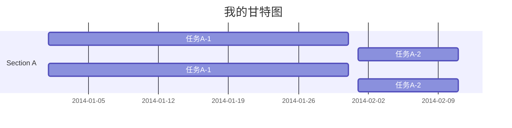
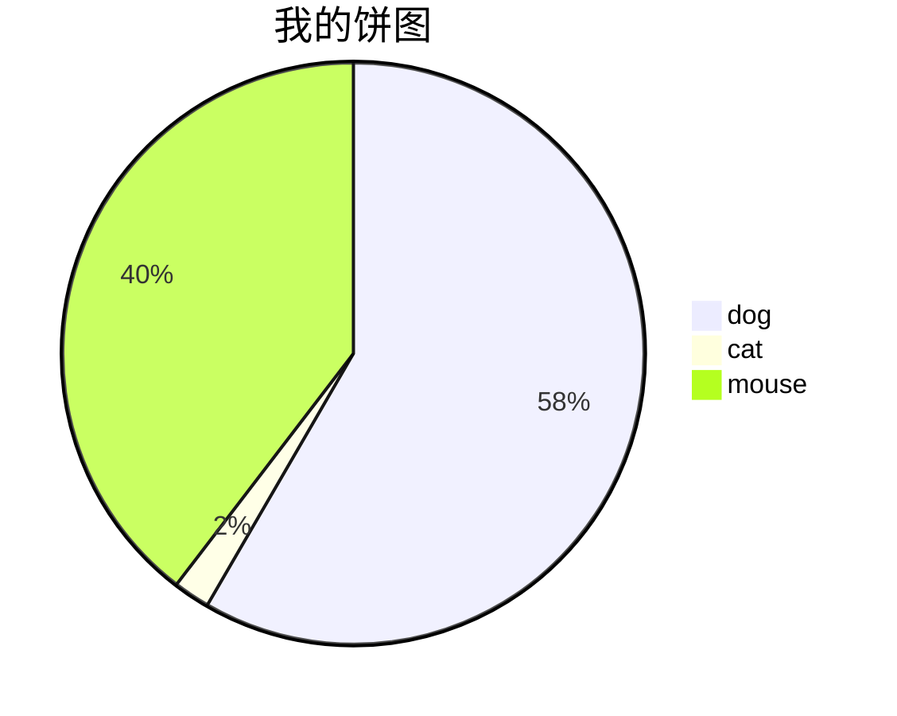
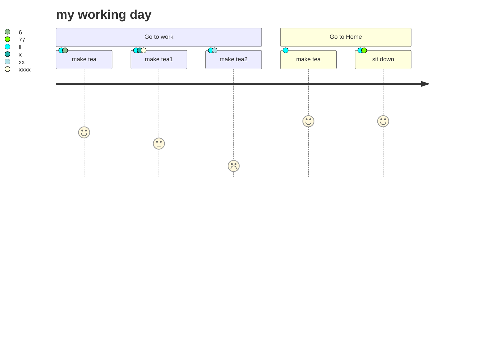
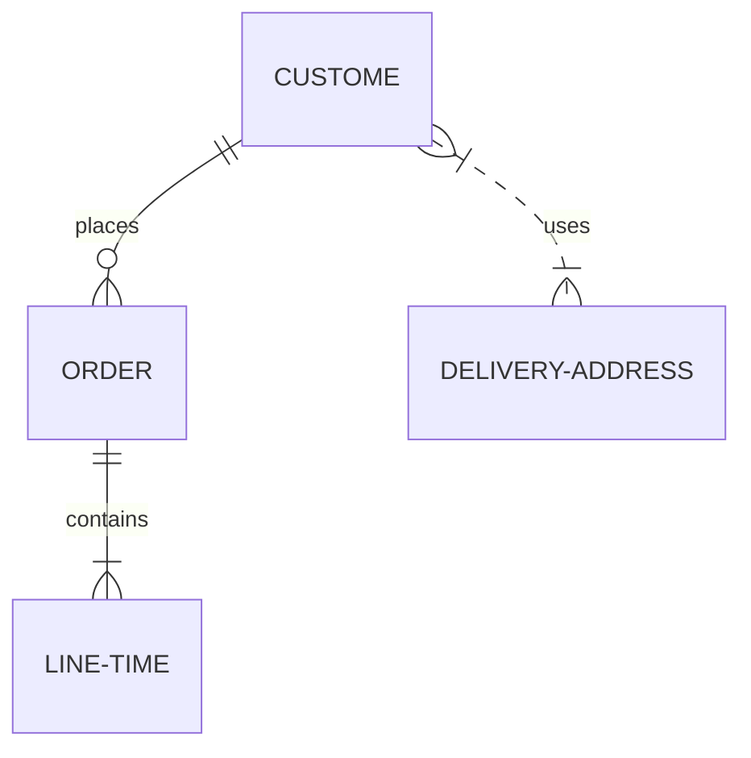
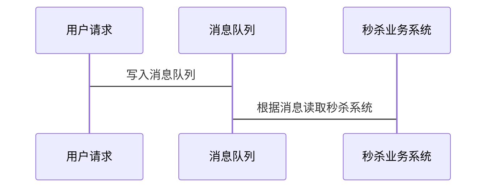

# Md

\[toc\]

## MD语法说明

<a name="ids">我是木笔啊位置</a>

## [ID234](#ID234)

横线

效果：

标题

```text
# 一级标题
## 二级标题
### 三级标题
#### 四级标题
##### 五级标题
###### 六级标题
```

效果：

## 一级标题

### 二级标题

#### 三级标题

**四级标题**

**五级标题**

**六级标题**

普通文本

```text
这是普通文本
```

效果：

这是普通文本[^2][^1]<sup>s</sup>


```
[^2]:HyperText Markup Language 超文本标记语言
```

文本块

```text
    a
    b
    c
```

效果：

```text
a
b
c
```

代码

```c
    int main (void)
    {
        return 0;
    }
```

效果：

```c
int main (void)
{
    return 0;
}
```

高亮

`高亮文字` `tag`

效果：

`高亮文字` `tag`

字体

```text
*斜体*
_斜体_
**粗体**
__粗体__
~~删除线~~
***粗斜体***
___粗斜体___
**~~粗斜体~~**
```

效果：

_斜体_ _斜体_

**粗体** **粗体**

~~删除线~~

_**粗斜体**_ _**粗斜体**_

~~**粗斜体**~~

URL

```text

[我的博客](http://blog.csdn.net/guodongxiaren "悬停显示")
```

效果：

 [我的博客](http://blog.csdn.net/guodongxiaren)

锚

```text
[跳至五级标题](#五级标题)
需要跳转的地方：<a name="divtop"> 我是目标位置 </a>
定义锚记：[跳转指定位置](#divtop)


## 标题 {#1}
跳转到[1](#1)
```

跳转到[ID23423](#MD语法说明)

[跳转到A哪里去](#ids)

效果：

[跳至五级标题](md.md#二级标题)

无序列表

* 硬件
* 软件
  * 语言
  * 算法
    * 排序
    * 链表

      效果：
* 硬件
* 软件
  * 语言
  * 算法
    * 排序
    * 链表

有序列表

1. 时间
2. 地点
3. 人物
   1. 张三
   2. 李四

效果：

1. 时间
2. 地点
3. 人物
   1. 张三
   2. 李四

引用

> 生物
>
> > 动物
> >
> > > 人

效果

> 生物
>
> > 动物
> >
> > > 人

表格

| 月份 | 收入 | 支出 |
| :--- | :--- | :--- |
| 8 | 1000 | 500 |
| 9 | 1200 | 600 |
| 10 | 1400 | 650 |

| 月份（居中对齐） | 收入（右对齐） | 支出（左对齐） |
| :---: | ---: | :--- |
| 8 | 1000 | 500 |
| 9 | 1200 | 600 |
| 10 | 1400 | 650 |

效果：

| 月份 | 收入 | 支出 |
| :--- | :--- | :--- |
| 8 | 1000 | 500 |
| 9 | 1200 | 600 |
| 10 | 1400 | 650 |

| 月份（居中对齐） | 收入（右对齐） | 支出（左对齐） |
| :---: | ---: | :--- |
| 8 | 1000 | 500 |
| 9 | 1200 | 600 |
| 10 | 1400 | 650 |

复选框

* [ ] abc
* [x] xx

效果：

* [ ] abc
* [x] xx

[](md.md)

[](Https://github.com/zbsilent)


  


|  |  |
| :--- | :--- |
| `?style=plastic&logo=appveyor` |  |
| `?style=flat&logo=appveyor` |  |
| `?style=flat-square&logo=appveyor` |  |
| `?style=for-the-badge&logo=appveyor` |  |
| `?style=social&logo=appveyor` |  |

### 常用按钮

$$
<kbd>Ctrl/Cmd</kbd>+<kbd>Alt</kbd>+<kbd>A</kbd>, <kbd>C</kbd>
$$


<kbd>Ctrl/Cmd</kbd>+<kbd>Alt</kbd>+<kbd>A</kbd>, <kbd>C</kbd>


[跳至五级标题](md.md##常用按钮)

_Reference:_ [_Action System in IntelliJ SDK Docs_](https://www.jetbrains.org/intellij/sdk/docs/basics/action_system.html)

\[file:DynamicActionGroup\]: ./src/main/java/org/intellij/sdk/action/DynamicActionGroup.java --&gt;


```tex
- 代表实线 ， 主动发送消息，比如 request请求
> 代表实心箭头 ， 同步消息，比如 AJAX 的同步请求
-- 代表虚线，表示返回消息，spring Controller return
>> 代表非实心箭头 ，异步消息，比如AJAX请求
```

```sequence
participant 用户请求
participant 消息队列
participant 秒杀业务系统

用户请求->消息队列:写入消息队列
秒杀业务系统->>消息队列:根据规则读取秒杀请求
```


```sequence
Title: md时序图练习
    participant 客户端
    participant 控制器
    participant 业务
    participant 数据库
    
     客户端->>数据库:提交数据店铺
     Note right of 客户端:提交数据进行验证
     控制器->>控制器:验证数据完整性
     Note left of 控制器:返回错误的字段信息
     控制器-->>客户端:数据不完整
     Note over 客户端: 用户输入通行证的账号、密码
     控制器->>业务:保存店铺到数据库
     业务->>业务:save店铺数据
     业务-->>控制器:保存出现异常
     控制器-->>客户端:保存成功
     数据库-->>业务:success
     业务-->>控制器:success
     控制器-->>客户端:success 客户端
     Note left of 控制器:返回正确的提示，并跳转到审核第二步
```


```flow
st=>start: Start
op=>operation: Operation
cond=>condition: Condition?
e=>end 
st->op->cond
cond(yes)->e
cond(no)->op
```











##### 时序图画法



----

[^2]: 测试 ↩

